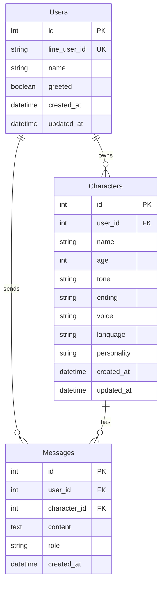

# Database Design

## ER Diagram

## Tables

### Users
| Column | Type | Constraints | Description |
|--------|------|-------------|-------------|
| id | BIGINT | PK, AUTO_INCREMENT | ユーザーID |
| line_user_id | VARCHAR(255) | UNIQUE, NOT NULL | LINE User ID |
| name | VARCHAR(255) | NULL | ユーザー名 |
| greeted | boolean | NOT NULL | 挨拶済み |
| created_at | DATETIME | NOT NULL | 作成日時 |
| updated_at | DATETIME | NOT NULL | 更新日時 |

### Characters
| Column | Type | Constraints | Description |
|--------|------|-------------|-------------|
| id | INTEGER | PK, AUTO_INCREMENT | キャラクターID |
| user_id | INTEGER | FK(users.id), NULL | 所有ユーザーID |
| name | VARCHAR(255) | NOT NULL | キャラクター名 |
| age | INT | NOT NULL | 年齢 |
| tone | VARCHAR(255) | NOT NULL | 話し方 |
| ending | VARCHAR(255) | NOT NULL | 語尾 |
| voice | VARCHAR(255) | NOT NULL | 声の特徴 |
| language | VARCHAR(50) | NOT NULL | 使用言語 |
| personality | TEXT | NOT NULL | 性格 |
| created_at | DATETIME | NOT NULL | 作成日時 |
| updated_at | DATETIME | NOT NULL | 更新日時 |

### Messages
| Column | Type | Constraints | Description |
|--------|------|-------------|-------------|
| id | BIGINT | PK, AUTO_INCREMENT | メッセージID |
| user_id | BIGINT | FK(users.id), NOT NULL | ユーザーID |
| character_id | BIGINT | FK(characters.id), NOT NULL | キャラクターID |
| content | TEXT | NOT NULL | メッセージ内容 |
| role | VARCHAR(50) | NOT NULL | メッセージの役割(user/assistant) |
| created_at | DATETIME | NOT NULL | 作成日時 |

## Indexes
- users_line_user_id_idx ON users(line_user_id)
- messages_user_id_idx ON messages(user_id)
- messages_character_id_idx ON messages(character_id)
- characters_user_id_idx ON characters(user_id) 
